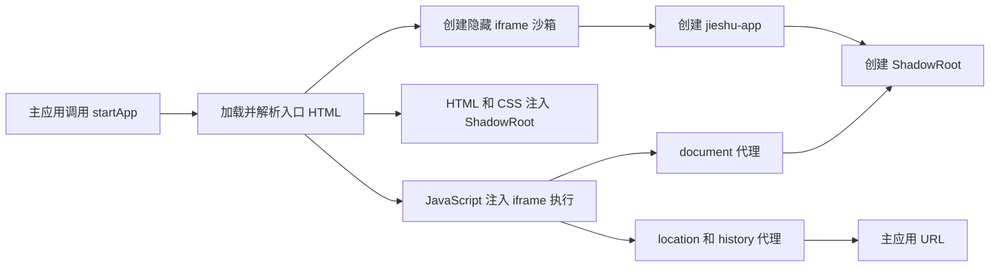
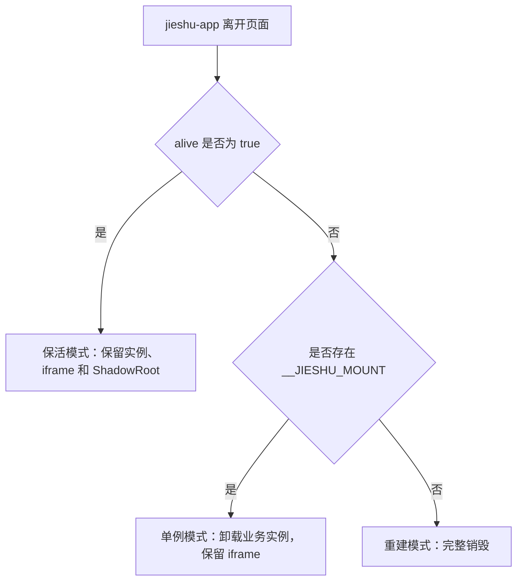

# Jieshu 实现原理与核心源码导读

本文面向希望深入理解 Jieshu 内部实现的开发者。阅读完本文后，你应该能够回答下面几个问题：

- Jieshu 为什么同时使用 iframe、Web Component 和 Shadow DOM？
- 子应用 JavaScript 在哪里运行，DOM 又渲染在哪里？
- `document.querySelector` 为什么能够查询到 iframe 外面的 ShadowRoot？
- 子应用的动态脚本、动态样式和路由是如何接管的？
- 保活模式、单例模式和重建模式有什么本质区别？
- 销毁一个子应用时，为什么不能只删除 iframe？

文中的代码是依据当前仓库实现提炼出的“关键控制流版本”。它保留核心结构并增加注释，省略了部分类型、插件钩子、错误处理和浏览器兼容分支。真正调试问题时，应当回到对应源码查看完整上下文。

---

## 1. Jieshu 的核心模型

一句话概括 Jieshu：

> 子应用 JavaScript 运行在隐藏的同源 iframe 中；子应用 DOM 和大部分 CSS 渲染在主应用页面中的 ShadowRoot；Jieshu 再代理 document、location、history 和动态资源操作，把两个环境连接起来。

可以把它理解为：

```text
Jieshu
├── iframe
│   ├── 子应用 JavaScript
│   ├── 独立 window
│   ├── 独立全局变量
│   ├── history
│   └── location
│
├── <jieshu-app>
│   └── ShadowRoot
│       ├── 子应用 HTML
│       ├── 子应用 head
│       ├── 子应用 body
│       └── 子应用 CSS
│
└── 桥接层
    ├── proxyWindow
    ├── proxyDocument
    ├── proxyLocation
    ├── Document.prototype 补丁
    ├── DOM 动态资源劫持
    └── 路由及事件同步
```

核心数据流如下：



这里一定要先区分两个概念：

```text
运行环境：隐藏 iframe
渲染环境：ShadowRoot
```

Jieshu 最重要的工作，就是让子应用误以为这两个环境仍然是同一个页面。

---

## 2. 为什么不能只使用 iframe

普通 iframe 的优点非常明显：

- JavaScript 全局变量天然隔离；
- CSS 天然隔离；
- DOM 天然隔离；
- 拥有完整的 window、document、history 和 location；
- 对旧项目和第三方库兼容性较好。

但它也隔离得过于彻底：

```text
主页面
└── iframe
    └── 子应用弹窗
```

子应用弹窗通常只能覆盖 iframe 自己的区域，难以自然融入主应用布局。iframe 的尺寸、滚动、路由持久化、通信和白屏问题也需要额外处理。

Jieshu 的选择是：

```text
保留 iframe 的 JavaScript Realm
舍弃 iframe 作为主要显示容器
把可见 DOM 放进主页面的 ShadowRoot
```

这样能够同时获得：

- iframe 提供的 JavaScript 隔离；
- Shadow DOM 提供的 CSS 隔离；
- 主文档中的自然布局、尺寸和弹窗体验；
- 独立的子应用 history；
- 应用级 keep-alive 能力。

---

## 3. Web Component 基础

Web Component 是一组浏览器原生组件技术。Jieshu 主要使用其中两部分：

```text
Custom Elements
    定义浏览器原本不存在的 <jieshu-app> 标签

Shadow DOM
    在 <jieshu-app> 内创建隔离的 DOM 和 CSS 边界
```

### 3.1 最小 Custom Element

```ts
class UserCard extends HTMLElement {
  connectedCallback() {
    // 元素被插入 document 时触发
    this.textContent = '用户卡片';
  }

  disconnectedCallback() {
    // 元素从 document 中移除时触发
    console.log('用户卡片已卸载');
  }
}

customElements.define('user-card', UserCard);
```

注册后，浏览器就认识下面的标签：

```html
<user-card></user-card>
```

Custom Element 常用生命周期如下：

```text
document.createElement("user-card")
        ↓
constructor

document.body.appendChild(element)
        ↓
connectedCallback

element.remove()
        ↓
disconnectedCallback
```

### 3.2 Shadow DOM

```ts
class UserCard extends HTMLElement {
  connectedCallback() {
    const shadowRoot = this.attachShadow({ mode: 'open' });

    shadowRoot.innerHTML = `
      <style>
        button { color: red; }
      </style>
      <button>Shadow DOM 按钮</button>
    `;
  }
}
```

页面结构类似：

```text
document
├── 主应用 button
└── <user-card>                 Shadow Host
    └── #shadow-root            Shadow Root
        ├── style
        └── button
```

ShadowRoot 内的 `button` 样式通常不会污染主应用按钮，主应用的普通 `button` 选择器通常也不会直接进入 ShadowRoot。

需要注意：Custom Element 和 Shadow DOM 不是同一个概念。

```text
Custom Element
    解决自定义标签和组件生命周期问题

Shadow DOM
    解决内部 DOM 边界和 CSS 隔离问题
```

---

## 4. Jieshu 如何使用 Web Component

相关源码：

```text
packages/jieshu-core/src/shadow.ts
```

核心实现可以整理为：

```ts
export function defineJieshuWebComponent() {
  // 同一个 Custom Element 名称不能重复注册
  if (customElements.get('jieshu-app')) return;

  class JieshuApp extends HTMLElement {
    connectedCallback() {
      /*
       * 保活模式下，同一个 <jieshu-app> 会被移出页面再插回来。
       * ShadowRoot 只能 attach 一次，因此已经存在时直接复用。
       */
      if (this.shadowRoot) return;

      const shadowRoot = this.attachShadow({ mode: 'open' });
      const appId = this.getAttribute('data-jieshu-id');
      const sandbox = getJieshuById(appId);

      // 修复 ShadowRoot 与 iframe Realm 之间的 DOM 语义
      patchElementEffect(shadowRoot, sandbox.iframe.contentWindow);

      // 让 Jieshu 实例持有可见 DOM 的根节点
      sandbox.shadowRoot = shadowRoot;
    }

    disconnectedCallback() {
      const appId = this.getAttribute('data-jieshu-id');
      const sandbox = getJieshuById(appId);

      // 根据保活、单例或重建模式选择 unmount/destroy
      handleJieshuAppDisconnect(sandbox);
    }
  }

  customElements.define('jieshu-app', JieshuApp);
}
```

Jieshu 运行时会创建这个元素：

```ts
export function createJieshuWebComponent(id: string): HTMLElement {
  const element = document.createElement('jieshu-app');

  // 用应用 name 关联对应的 Jieshu 实例
  element.setAttribute('data-jieshu-id', id);
  element.classList.add('jieshu_iframe');

  return element;
}
```

插入主应用容器后，浏览器自动执行 `connectedCallback`：

```ts
const webComponent = createJieshuWebComponent('orders');
const container = document.querySelector('#micro-app-container');

container.appendChild(webComponent);
```

最终结构大致如下：

```text
主应用 document
└── #micro-app-container
    └── <jieshu-app data-jieshu-id="orders">
        └── #shadow-root
            └── <html>
                ├── <head>
                │   └── 子应用样式
                └── <body>
                    └── 子应用页面
```

Web Component 在 Jieshu 中负责：

```text
1. 作为子应用 DOM 容器
2. 通过 ShadowRoot 提供 CSS 隔离
3. 通过 connected/disconnected 回调感知挂载和卸载
```

它不负责 JavaScript 隔离。JavaScript 隔离由 iframe 完成。

---

## 5. 源码模块地图

核心源码集中在：

```text
packages/jieshu-core/src/

index.ts       对外入口：startApp、preloadApp、destroyApp
sandbox.ts     Jieshu 实例，统筹 iframe、ShadowRoot 和生命周期
iframe.ts      iframe 创建、脚本执行、window/document/history 补丁
proxy.ts       proxyWindow、proxyDocument、proxyLocation
shadow.ts      Web Component、ShadowRoot 和 HTML 渲染
entry.ts       请求 HTML、JavaScript、CSS 和资源缓存
template.ts    解析入口 HTML
effect.ts      劫持动态 script、link、style
sync.ts        主子应用路由同步
event.ts       EventBus 通信
tracker.ts     跟踪并回收转发到主环境的事件副作用
common.ts      实例缓存以及浏览器原生方法缓存
```

建议按照下面的顺序阅读：

```text
index.ts
  ↓
sandbox.ts
  ├── iframe.ts
  ├── proxy.ts
  ├── shadow.ts
  ├── effect.ts
  └── sync.ts
```

---

## 6. `startApp` 总流程

相关源码：

```text
packages/jieshu-core/src/index.ts
```

精简后的关键控制流如下：

```ts
export async function startApp(startOptions: StartOptions) {
  // 尝试获取已存在的实例
  const oldSandbox = getJieshuById(startOptions.name);

  // 合并 setupApp 缓存配置和本次 startApp 配置
  const options = mergeOptions(startOptions, getOptionsById(startOptions.name));

  const { name, url, html, el, alive, sync, prefix, props, fetch, replace, plugins, lifecycles, fiber } = options;

  /*
   * 已存在实例优先复用：
   *
   * alive=true             → 保活模式
   * 存在 __JIESHU_MOUNT     → 单例模式
   * 两者都不满足           → 销毁后重建
   */
  if (oldSandbox) {
    const iframeWindow = oldSandbox.iframe.contentWindow;

    if (oldSandbox.preload) {
      await oldSandbox.preload;
    }

    if (alive) {
      await oldSandbox.active({
        url,
        sync,
        prefix,
        el,
        props,
        alive,
        fetch,
        replace,
      });

      // 预加载可能只下载了资源，没有执行 JavaScript
      if (!oldSandbox.execFlag) {
        const { getExternalScripts } = await importHTML({
          url,
          html,
          opts: { fetch, plugins, fiber },
        });

        await oldSandbox.start(getExternalScripts);
      }

      return () => oldSandbox.destroy();
    }

    if (typeof iframeWindow.__JIESHU_MOUNT === 'function') {
      await oldSandbox.unmount();

      await oldSandbox.active({
        url,
        sync,
        prefix,
        el,
        props,
        alive,
        fetch,
        replace,
      });

      // JavaScript 不重新执行，恢复上次登记的动态样式
      oldSandbox.rebuildStyleSheets();

      iframeWindow.__JIESHU_MOUNT();
      oldSandbox.mountFlag = true;

      return () => oldSandbox.destroy();
    }

    // 重建模式：旧实例没有复用价值
    await oldSandbox.destroy();
  }

  // 创建 iframe 沙箱和各种代理
  const sandbox = new Jieshu({
    name,
    url,
    fiber,
    plugins,
    lifecycles,
  });

  // 请求并解析入口 HTML
  const { template, getExternalScripts, getExternalStyleSheets } = await importHTML({
    url,
    html,
    opts: {
      fetch,
      plugins: sandbox.plugins,
      fiber,
    },
  });

  // 下载外部 CSS，并重新嵌入模板
  const processedHtml = await processCssLoader(sandbox, template, getExternalStyleSheets);

  // 创建 Web Component、ShadowRoot，并渲染 HTML
  await sandbox.active({
    url,
    sync,
    prefix,
    template: processedHtml,
    el,
    props,
    alive,
    fetch,
    replace,
  });

  // 在隐藏 iframe 中执行子应用 JavaScript
  await sandbox.start(getExternalScripts);

  return () => sandbox.destroy();
}
```

主流程可以简化成：

```text
解析配置
  → 创建 iframe 沙箱
  → 加载入口 HTML
  → 分离 JavaScript 和 CSS
  → 创建 jieshu-app 和 ShadowRoot
  → 渲染 DOM 和 CSS
  → 在 iframe 中执行 JavaScript
```

---

## 7. `Jieshu` 实例的职责

相关源码：

```text
packages/jieshu-core/src/sandbox.ts
```

一个 `Jieshu` 实例代表一个子应用运行环境，主要持有：

```ts
class Jieshu {
  id: string;
  url: string;

  // JavaScript 执行环境
  iframe: HTMLIFrameElement;

  // 三个关键代理
  proxy: WindowProxy;
  proxyDocument: object;
  proxyLocation: object;

  // 可见 DOM 根节点
  shadowRoot: ShadowRoot;

  // 主应用提供给子应用的能力
  provide: {
    props?: Record<string, unknown>;
    bus: EventBus;
    location?: object;
    shadowRoot?: ShadowRoot;
  };

  template: string;
  execQueue: Array<() => void>;

  execFlag: boolean;
  activeFlag: boolean;
  mountFlag: boolean;
  alive: boolean;

  // 需要在卸载或销毁阶段处理的动态副作用
  styleSheetElements: Array<HTMLStyleElement | HTMLLinkElement>;
  dynamicScriptElements: HTMLScriptElement[];
  deferredStyleObservers: MutationObserver[];
}
```

构造函数的主干逻辑：

```ts
constructor(options: JieshuOptions) {
  const {
    name,
    url,
    attrs,
    fiber,
    plugins,
    lifecycles,
  } = options;

  this.id = name;
  this.url = url;
  this.fiber = fiber;

  this.execQueue = [];
  this.styleSheetElements = [];
  this.dynamicScriptElements = [];
  this.deferredStyleObservers = [];

  this.plugins = getPlugins(plugins);
  this.lifecycles = lifecycles;

  this.bus = new EventBus(this.id);
  this.provide = { bus: this.bus };

  // 解析子应用域名和路由
  const {
    urlElement,
    appHostPath,
    appRoutePath,
  } = appRouteParse(url);

  const mainHostPath =
    window.location.protocol + "//" + window.location.host;

  // 创建隐藏的 JavaScript iframe
  this.iframe = iframeGenerator(
    this,
    attrs,
    mainHostPath,
    appHostPath,
    appRoutePath
  );

  // 创建 window/document/location 代理
  const {
    proxyWindow,
    proxyDocument,
    proxyLocation,
    proxyRevoke,
  } = proxyGenerator(
    this.iframe,
    urlElement,
    mainHostPath,
    appHostPath
  );

  this.proxy = proxyWindow;
  this.proxyDocument = proxyDocument;
  this.proxyLocation = proxyLocation;
  this.proxyRevoke = proxyRevoke;

  this.provide.location = proxyLocation;

  // 以子应用 name 为 key 注册实例
  addSandboxCacheWithJieshu(this.id, this);
}
```

---

## 8. 隐藏 iframe 的创建与初始化

相关源码：

```text
packages/jieshu-core/src/iframe.ts
```

iframe 的主要用途是提供一个完整、独立的浏览器 Realm：

```text
iframe window
├── 全局变量
├── 原型链
├── DOM 构造器
├── history
├── location
├── 事件系统
└── 模块执行环境
```

精简后的创建逻辑：

```ts
const EMPTY_DOCUMENT = '<!DOCTYPE html><html><head></head><body></body></html>';

export function iframeGenerator(
  sandbox: Jieshu,
  attrs: Record<string, unknown>,
  mainHostPath: string,
  appHostPath: string,
  appRoutePath: string,
): HTMLIFrameElement {
  const iframe = document.createElement('iframe');

  /*
   * srcdoc 创建一个空白且继承主应用 origin 的文档：
   *
   * - 不请求主应用 HTML
   * - 不执行主应用入口代码
   * - 主应用可以访问 contentDocument
   */
  setAttrsToElement(iframe, {
    style: 'display: none',
    name: sandbox.id,
    srcdoc: EMPTY_DOCUMENT,
    ...attrs,
  });

  document.body.appendChild(iframe);

  const iframeWindow = iframe.contentWindow;

  // 在 iframe 初始化早期注入 Jieshu 上下文
  iframeWindow.__JIESHU = sandbox;
  iframeWindow.__JIESHU_PUBLIC_PATH__ = appHostPath + '/';
  iframeWindow.__JIESHU_RAW_WINDOW__ = iframeWindow;
  iframeWindow.$jieshu = sandbox.provide;

  sandbox.iframeReady = stopIframeLoading(iframe).then(() => {
    /*
     * 初始化 iframe 内部环境：
     *
     * - 创建基础 HTML 结构
     * - 保存浏览器原始方法
     * - 注入 base
     * - patch history
     * - patch window/document/Node
     * - patch 相对路径和内联事件
     */
    initIframeDom(iframeWindow, sandbox, mainHostPath, appHostPath);

    iframeWindow.history.replaceState(null, '', mainHostPath + appRoutePath);
  });

  return iframe;
}
```

这里有一个关键设计：

```text
iframe 真实 origin：主应用 origin
proxyLocation 展现的 origin：子应用 origin
```

这样做既保证 iframe 与主应用同源、能够被框架控制，又让子应用代码看到符合自身预期的 URL。

---

## 9. `proxyWindow`：隔离全局变量

相关源码：

```text
packages/jieshu-core/src/proxy.ts
```

精简实现：

```ts
const { proxy: proxyWindow, revoke: revokeWindow } = Proxy.revocable(iframe.contentWindow, {
  get(target, key) {
    // location 必须返回子应用视角的代理对象
    if (key === 'location') {
      return target.__JIESHU.proxyLocation;
    }

    // 保持 window.window === window 和 window.self === window
    if (key === 'window' || key === 'self') {
      return target.__JIESHU.proxy;
    }

    const value = target[key];

    // 修复浏览器原生方法的 this，避免 Illegal invocation
    if (typeof value === 'function') {
      return value.bind(target);
    }

    return value;
  },

  set(target, key, value) {
    // 子应用全局变量最终写入 iframe window
    target[key] = value;
    return true;
  },

  has(target, key) {
    return key in target;
  },
});
```

子应用执行：

```js
window.userToken = 'abc';
```

结果是：

```text
主应用 window.userToken           不存在
iframe.contentWindow.userToken    "abc"
```

JavaScript 隔离的根本来源是独立 iframe window，而不是 Proxy 自己。Proxy 主要负责修正访问语义。

---

## 10. `proxyLocation`：伪装子应用地址

真实 iframe 与主应用同源，子应用却应当认为自己运行在原来的域名和路径下，因此 Jieshu 提供 `proxyLocation`。

```ts
const { proxy: proxyLocation, revoke: revokeLocation } = Proxy.revocable(
  {},
  {
    get(_target, key) {
      const realLocation = iframe.contentWindow.location;

      // 域名相关信息来自子应用入口地址
      if (key === 'host' || key === 'hostname' || key === 'protocol' || key === 'port' || key === 'origin') {
        return childUrlElement[key];
      }

      // 路径来自 iframe 当前 history，但把主域名替换为子应用域名
      if (key === 'href') {
        return realLocation.href.replace(mainHostPath, appHostPath);
      }

      if (key === 'reload') {
        return () => {
          console.warn('Jieshu 中 location.reload 被接管');
        };
      }

      return realLocation[key];
    },

    set(_target, key, value) {
      if (key === 'href') {
        // href 赋值属于页面级跳转，需要单独处理
        return handleLocationHref(value);
      }

      iframe.contentWindow.location[key] = value;
      return true;
    },
  },
);
```

需要区分两种跳转：

```text
history.pushState / replaceState
    子应用 SPA 路由变化

location.href = newUrl
    页面级跳转，可能需要用可见 iframe 替换当前应用
```

---

## 11. HTML、JavaScript 和 CSS 的拆分

相关源码：

```text
packages/jieshu-core/src/entry.ts
packages/jieshu-core/src/template.ts
```

入口 HTML 会被拆成：

```text
入口 HTML
├── template
├── scripts[]
└── styles[]
```

解析器会处理：

- 外部 `<script src="...">`；
- 内联 `<script>`；
- `async`、`defer`、`module`；
- 外部 `<link rel="stylesheet">`；
- 内联 `<style>`；
- 相对资源地址；
- ignore/exclude 插件规则。

伪代码：

```ts
function processTpl(html: string, baseURI: string) {
  const scripts = [];
  const styles = [];

  const template = html
    .replace(LINK_TAG_REGEX, (linkTag) => {
      const href = resolveLinkHref(linkTag, baseURI);

      styles.push({ src: href });

      // 原位置保留注释，CSS 下载后会重新嵌入
      return `<!-- stylesheet ${href} replaced by jieshu -->`;
    })
    .replace(STYLE_TAG_REGEX, (styleTag) => {
      styles.push({
        src: '',
        content: getInlineCode(styleTag),
      });

      return '<!-- inline style replaced by jieshu -->';
    })
    .replace(SCRIPT_TAG_REGEX, (scriptTag) => {
      scripts.push(parseScript(scriptTag, baseURI));

      return '<!-- script replaced by jieshu -->';
    });

  return {
    template,
    scripts,
    styles,
  };
}
```

外部 CSS 下载后通常会重新变成 `<style>`：

```ts
async function embedStyles(template, styleResults) {
  let result = template;

  for (const styleResult of styleResults) {
    const css = await styleResult.contentPromise;

    result = result.replace(styleResult.placeholder, `<style>${css}</style>`);
  }

  return result;
}
```

这样 Jieshu 就能在 CSS 进入 ShadowRoot 前统一处理相对路径、插件 loader 和特殊规则。

---

## 12. HTML 如何进入 ShadowRoot

相关源码：

```text
packages/jieshu-core/src/shadow.ts
```

```ts
export async function renderTemplateToShadowRoot(shadowRoot: ShadowRoot, iframeWindow: Window, template: string) {
  /*
   * 使用 iframe document 创建子应用节点，
   * 随后再通过补丁维持跨 Realm 语义。
   */
  const html = renderTemplateToHtml(iframeWindow, template);

  const processedHtml = await processCssLoaderForTemplate(iframeWindow.__JIESHU, html);

  // 可见 DOM 实际进入主页面中的 ShadowRoot
  shadowRoot.appendChild(processedHtml);

  /*
   * ShadowRoot 原生没有 head/body 属性。
   * Jieshu 手动保存引用，供 proxyDocument 使用。
   */
  shadowRoot.head = shadowRoot.querySelector('head');
  shadowRoot.body = shadowRoot.querySelector('body');

  // 劫持后续动态插入的 script/link/style
  patchRenderEffect(shadowRoot, iframeWindow.__JIESHU.id, false);
}
```

这里的关键不是简单设置 `innerHTML`，而是需要遍历和修复元素：

```ts
function renderTemplateToHtml(iframeWindow: Window, template: string) {
  const iframeDocument = iframeWindow.document;
  const html = iframeDocument.createElement('html');

  html.innerHTML = template;

  const iterator = iframeDocument.createTreeWalker(html, NodeFilter.SHOW_ELEMENT);

  let element = iterator.currentNode as HTMLElement;

  while (element) {
    // 修复 ownerDocument、baseURI、内联事件等
    patchElementEffect(element, iframeWindow);

    // 将 img/src、link/href 等相对地址转换为正确地址
    patchRelativeAttribute(element);

    element = iterator.nextNode() as HTMLElement;
  }

  return html;
}
```

---

## 13. `proxyDocument`：连接 iframe 与 ShadowRoot

相关源码：

```text
packages/jieshu-core/src/proxy.ts
packages/jieshu-core/src/iframe.ts
```

这是整个 Jieshu 架构中最关键的部分。

子应用执行：

```js
document.querySelector('#app');
document.body.appendChild(dialog);
```

真正需要查询和修改的却是 ShadowRoot。

精简后的 `proxyDocument`：

```ts
const { proxy: proxyDocument, revoke: revokeDocument } = Proxy.revocable(
  {},
  {
    get(_target, key) {
      const sandbox = iframe.contentWindow.__JIESHU;
      const shadowRoot = sandbox.shadowRoot;
      const iframeDocument = iframe.contentDocument;

      if (key === 'createElement') {
        return function createElement(tagName: string) {
          // 使用 iframe Realm 中的原生 Document 创建节点
          const element = iframeDocument.createElement(tagName);

          patchElementEffect(element, iframe.contentWindow);

          return element;
        };
      }

      if (key === 'createTextNode') {
        return iframeDocument.createTextNode.bind(iframeDocument);
      }

      // DOM 查询转发到 ShadowRoot
      if (key === 'querySelector') {
        return shadowRoot.querySelector.bind(shadowRoot);
      }

      if (key === 'querySelectorAll') {
        return shadowRoot.querySelectorAll.bind(shadowRoot);
      }

      if (key === 'getElementById') {
        return function getElementById(id: string) {
          return shadowRoot.querySelector(`[id="${id}"]`);
        };
      }

      if (key === 'getElementsByTagName') {
        return function getElementsByTagName(tagName: string) {
          // JavaScript 节点实际位于 iframe document
          if (tagName === 'script') {
            return iframeDocument.scripts;
          }

          return shadowRoot.querySelectorAll(tagName);
        };
      }

      if (key === 'head') return shadowRoot.head;
      if (key === 'body') return shadowRoot.body;

      if (key === 'documentElement' || key === 'scrollingElement') {
        return shadowRoot.firstElementChild;
      }

      // 其他能力按分类返回 ShadowRoot、iframe document 或主 document
      const value = iframeDocument[key];

      return typeof value === 'function' ? value.bind(iframeDocument) : value;
    },
  },
);
```

但只有 `proxyDocument` 还不够。子应用中的裸变量 `document` 首先指向 iframe 真实 document，因此 Jieshu 还要修改 iframe Realm 的 `Document.prototype`：

```ts
export function patchDocumentEffect(iframeWindow: Window) {
  const sandbox = iframeWindow.__JIESHU;

  const proxyKeys = [
    'head',
    'body',
    'documentElement',
    'querySelector',
    'querySelectorAll',
    'getElementById',
    'getElementsByTagName',
    'activeElement',
    'scrollingElement',
  ];

  for (const key of proxyKeys) {
    Object.defineProperty(iframeWindow.Document.prototype, key, {
      configurable: true,
      get() {
        return sandbox.proxyDocument[key];
      },
    });
  }
}
```

完整调用链：

```text
子应用 document.querySelector
        ↓
iframe Document.prototype.querySelector
        ↓
sandbox.proxyDocument.querySelector
        ↓
shadowRoot.querySelector
        ↓
找到可见 DOM
```

这条链就是 Jieshu “JavaScript 与 DOM 分离”能够成立的核心。

---

## 14. JavaScript 如何进入 iframe 执行

相关源码：

```text
packages/jieshu-core/src/iframe.ts
packages/jieshu-core/src/sandbox.ts
```

普通脚本会被包装后插入 iframe：

```ts
export function insertScriptToIframe(scriptResult: ScriptResult, iframeWindow: Window) {
  const { src, content, module, async } = scriptResult;

  const script = iframeWindow.document.createElement('script');
  let code = content || '';

  /*
   * 普通内联脚本通过函数参数修正：
   *
   * window/self/global → proxyWindow
   * location           → proxyLocation
   * this               → proxyWindow
   */
  if (content && !module) {
    code = `
      (function(window, self, global, location) {
        ${code}
      }).bind(window.__JIESHU.proxy)(
        window.__JIESHU.proxy,
        window.__JIESHU.proxy,
        window.__JIESHU.proxy,
        window.__JIESHU.proxyLocation
      );
    `;
  }

  if (src && !content) {
    script.src = src;
  } else {
    script.textContent = code;
  }

  if (module) {
    script.type = 'module';
  }

  const head = iframeWindow.document.querySelector('head');

  // 插入脚本时，浏览器在 iframe Realm 中执行代码
  head.appendChild(script);

  if (!async) {
    iframeWindow.__JIESHU.execQueue.shift()?.();
  }
}
```

Jieshu 没有简单地把所有代码都交给 `eval`，而是尽量使用浏览器的脚本执行机制。这样可以保留 iframe Realm、模块行为、原型链以及更接近原生的异常堆栈。

### 14.1 执行顺序

```ts
public async start(getExternalScripts: () => ScriptResultList) {
  this.execFlag = true;

  const scripts = await getExternalScripts();
  const iframeWindow = this.iframe.contentWindow;

  const syncScripts = [];
  const deferScripts = [];
  const asyncScripts = [];

  for (const script of scripts) {
    if (script.defer) {
      deferScripts.push(script);
    } else if (script.async) {
      asyncScripts.push(script);
    } else {
      syncScripts.push(script);
    }
  }

  // 同步和 defer 脚本进入串行队列
  for (const script of [...syncScripts, ...deferScripts]) {
    this.execQueue.push(async () => {
      const content = await script.contentPromise;

      insertScriptToIframe(
        { ...script, content },
        iframeWindow
      );
    });
  }

  // async 脚本下载完成后独立执行
  for (const script of asyncScripts) {
    script.contentPromise.then((content) => {
      insertScriptToIframe(
        { ...script, content },
        iframeWindow
      );
    });
  }

  // 脚本执行完成后尝试挂载应用
  this.execQueue.push(() => this.mount());

  // 模拟浏览器加载事件
  this.execQueue.push(() => {
    iframeWindow.document.dispatchEvent(
      new Event("DOMContentLoaded")
    );

    iframeWindow.dispatchEvent(
      new Event("DOMContentLoaded")
    );

    this.execQueue.shift()?.();
  });

  this.execQueue.push(() => {
    iframeWindow.dispatchEvent(new Event("load"));
    this.execQueue.shift()?.();
  });

  // 启动串行队列
  this.execQueue.shift()?.();
}
```

执行顺序大致为：

```text
jsBeforeLoaders
  ↓
同步 scripts
  ↓
defer scripts
  ↓
mount
  ↓
DOMContentLoaded
  ↓
jsAfterLoaders
  ↓
load
```

`fiber` 模式会把部分工作放入 `requestIdleCallback`，降低连续脚本执行对主线程的阻塞。

---

## 15. 动态 `script`、`link` 和 `style`

相关源码：

```text
packages/jieshu-core/src/effect.ts
```

仅处理入口 HTML 中的静态资源还不够。运行中的应用会执行：

```js
document.head.appendChild(script);
document.head.appendChild(link);
document.head.appendChild(style);
```

常见来源包括：

- webpack 动态 chunk；
- Vite 开发环境 CSS 和 HMR；
- JSONP；
- 富文本编辑器皮肤；
- UI 框架运行时样式；
- 第三方组件按需加载资源。

Jieshu 会改写 ShadowRoot 中 `head/body` 的 `appendChild` 和 `insertBefore`：

```ts
function rewriteAppendChild(sandboxId: string, rawAppendChild: typeof Node.prototype.appendChild) {
  return function appendChild(this: HTMLHeadElement, node: Node) {
    const sandbox = getJieshuById(sandboxId);
    const element = node as HTMLElement;

    switch (element.tagName) {
      case 'SCRIPT': {
        const script = element as HTMLScriptElement;

        /*
         * ShadowRoot 负责显示，不是 JavaScript Realm。
         * 动态脚本必须转发到隐藏 iframe 执行。
         */
        loadScript(script.src).then((content) => {
          insertScriptToIframe(
            {
              src: script.src,
              content,
              async: script.async,
              module: script.type === 'module',
            },
            sandbox.iframe.contentWindow,
            script,
          );
        });

        return rawAppendChild.call(this, document.createComment('dynamic script replaced by jieshu'));
      }

      case 'LINK': {
        const link = element as HTMLLinkElement;

        if (link.rel !== 'stylesheet') {
          return rawAppendChild.call(this, node);
        }

        // 下载 CSS，改写后转成 style 插入 ShadowRoot
        loadStyle(link.href).then((css) => {
          const style = sandbox.iframe.contentDocument.createElement('style');

          style.textContent = rewriteCssUrls(css, link.href);
          sandbox.styleSheetElements.push(style);

          rawAppendChild.call(this, style);
        });

        return rawAppendChild.call(this, document.createComment('dynamic stylesheet replaced by jieshu'));
      }

      case 'STYLE': {
        const style = element as HTMLStyleElement;

        /*
         * 继续劫持：
         *
         * style.textContent = css
         * style.innerHTML = css
         * style.sheet.insertRule(rule)
         * style.appendChild(textNode)
         */
        patchStylesheetElement(style, sandbox);
        sandbox.styleSheetElements.push(style);

        return rawAppendChild.call(this, style);
      }

      default: {
        patchElementEffect(element, sandbox.iframe.contentWindow);

        return rawAppendChild.call(this, node);
      }
    }
  };
}
```

核心规则始终是：

```text
普通 DOM → ShadowRoot
JavaScript → 隐藏 iframe
CSS        → ShadowRoot
```

---

## 16. CSS 隔离与特殊规则

Shadow DOM 提供主要 CSS 隔离，但仍有需要补丁的情况。

### 16.1 `:root`

子应用可能包含：

```css
:root {
  --primary-color: #1677ff;
}
```

在 ShadowRoot 中，Jieshu 会将需要的 `:root` 规则复制并改写为 `:host`：

```css
:host {
  --primary-color: #1677ff;
}
```

### 16.2 `@font-face`

字体规则在 Shadow DOM 和嵌套子应用中存在特殊传播问题。Jieshu 会提取 `@font-face`，放入最外层 document 的专用 style 容器，并登记所属应用，销毁时再移除。

核心处理可以理解为：

```ts
function getPatchStyleElements(styleSheets: CSSStyleSheet[]) {
  const rootRules = [];
  const fontFaceRules = [];

  for (const styleSheet of styleSheets) {
    for (const rule of styleSheet.cssRules) {
      if (rule.cssText.includes(':root')) {
        rootRules.push(rule.cssText.replace(/:root/g, ':host'));
      }

      if (rule.type === CSSRule.FONT_FACE_RULE) {
        fontFaceRules.push(rule.cssText);
      }
    }
  }

  return {
    hostStyle: createStyle(rootRules),
    fontStyle: createStyle(fontFaceRules),
  };
}
```

因此，准确的说法不是“用了 Shadow DOM 就什么都不用处理”，而是：

> Shadow DOM 提供基础隔离，Jieshu 再处理 `:root`、`@font-face`、动态样式、CSS 相对路径和 HMR 等兼容问题。

---

## 17. 路由同步

相关源码：

```text
packages/jieshu-core/src/iframe.ts
packages/jieshu-core/src/sync.ts
```

iframe 自己拥有 history，因此子应用 SPA 路由天然与主应用路由分开。问题是刷新主页面后，iframe 内存中的路由会丢失。

Jieshu 的处理方式是把子应用路由写入主应用 query：

```text
子应用 name：orders
子应用路由：/detail/100?tab=payment#result

主应用 URL：
?orders=%2Fdetail%2F100%3Ftab%3Dpayment%23result
```

首先劫持 iframe history：

```ts
function patchIframeHistory(iframeWindow: Window, appHostPath: string, mainHostPath: string) {
  const history = iframeWindow.history;
  const rawPushState = history.pushState.bind(history);
  const rawReplaceState = history.replaceState.bind(history);

  history.pushState = function (data, title, url) {
    // 将子应用域名转换为 iframe 所在的主应用域名
    const iframeUrl = url?.replace(appHostPath, mainHostPath);

    rawPushState(data, title, iframeUrl);
    syncUrlToWindow(iframeWindow);
  };

  history.replaceState = function (data, title, url) {
    const iframeUrl = url?.replace(appHostPath, mainHostPath);

    rawReplaceState(data, title, iframeUrl);
    syncUrlToWindow(iframeWindow);
  };
}
```

同步到主应用：

```ts
export function syncUrlToWindow(iframeWindow: Window) {
  const { id, sync } = iframeWindow.__JIESHU;

  if (!sync) return;

  const childRoute = iframeWindow.location.pathname + iframeWindow.location.search + iframeWindow.location.hash;

  const mainUrl = new URL(window.location.href);

  mainUrl.searchParams.set(id, childRoute);

  window.history.replaceState(null, '', mainUrl.href);
}
```

刷新后，再从主应用 URL 恢复 iframe 路由：

```ts
export function syncUrlToIframe(iframeWindow: Window) {
  const { id, sync, url } = iframeWindow.__JIESHU;
  let targetUrl = url;

  if (sync) {
    const mainUrl = new URL(window.location.href);
    const savedRoute = mainUrl.searchParams.get(id);

    if (savedRoute) {
      targetUrl = savedRoute;
    }
  }

  const route = parseAppRoute(targetUrl);

  iframeWindow.history.replaceState(null, '', iframeWindow.__JIESHU.inject.mainHostPath + route);
}
```

一个页面可以同时同步多个子应用：

```text
?orders=/detail/100
&finance=/invoice/2026
&users=/profile/42
```

---

## 18. 事件转发与跨 Realm 问题

由于 JavaScript 和 DOM 不在同一个 Realm，很多浏览器细节需要修复。

### 18.1 document 事件

子应用执行：

```js
document.addEventListener('click', handler);
```

这个监听不能一律注册到 iframe document，因为用户点击的是 ShadowRoot 中的可见 DOM。Jieshu 会按事件类型决定注册位置：

```text
某些事件 → iframe document
某些事件 → ShadowRoot
某些事件 → 主应用 document
某些事件 → ShadowRoot 和主 document 两边
```

简化逻辑：

```ts
iframeWindow.Document.prototype.addEventListener = function (type, handler, options) {
  const callback = bindHandlerToDocument(handler, this);

  if (shouldListenOnIframeDocument(type)) {
    return rawAddEventListener.call(this, type, callback, options);
  }

  if (shouldListenOnMainDocument(type)) {
    sandbox.eventCleanupTracker.trackMainDocumentListener({
      type,
      callback,
      options,
    });

    return window.document.addEventListener(type, callback, options);
  }

  return sandbox.shadowRoot.addEventListener(type, callback, options);
};
```

### 18.2 `instanceof`

JavaScript 运行在 iframe，而 DOM 可能属于另一个 Realm，因此可能出现：

```js
element instanceof iframeWindow.HTMLElement;
```

返回 `false` 的问题。

当前实现会为相关 DOM 构造器补充 `Symbol.hasInstance`，让两个 Realm 的对象都可以被识别：

```ts
Object.defineProperty(TargetConstructor, Symbol.hasInstance, {
  configurable: true,
  value(element) {
    return nativeHasInstance.call(this, element) || nativeHasInstance.call(PeerConstructor, element);
  },
});
```

### 18.3 `ownerDocument` 和 `baseURI`

Jieshu 会给元素补充访问器：

```ts
Object.defineProperties(element, {
  baseURI: {
    configurable: true,
    get() {
      const location = iframeWindow.__JIESHU.proxyLocation;

      return location.protocol + '//' + location.host + location.pathname;
    },
  },

  ownerDocument: {
    configurable: true,
    get() {
      return iframeWindow.document;
    },
  },
});
```

真实实现还使用弱引用和销毁后的安全回退，避免散落在主 DOM 中的元素通过 getter 永久持有 iframe。

---

## 19. 三种运行模式

Jieshu 根据 `alive` 和子应用生命周期函数决定运行模式。



### 19.1 保活模式

```text
alive = true
```

离开页面时：

- `<jieshu-app>` 从 document 中移除；
- ShadowRoot 对象仍保留；
- iframe 保留；
- 子应用业务实例和状态保留；
- 路由状态保留。

重新进入时，只需要把同一个 `<jieshu-app>` 插回容器。

### 19.2 单例模式

```text
alive = false
存在 window.__JIESHU_MOUNT
存在 window.__JIESHU_UNMOUNT
```

离开时调用 `__JIESHU_UNMOUNT`，重新进入时恢复 DOM/CSS 并调用 `__JIESHU_MOUNT`。iframe 和已经加载的 JavaScript 模块继续复用。

### 19.3 重建模式

```text
alive = false
不存在生命周期改造
```

离开时销毁：

- Web Component；
- ShadowRoot；
- iframe；
- Jieshu 实例；
- 子应用业务实例；
- 代理和动态副作用。

核心判断：

```ts
function handleJieshuAppDisconnect(sandbox: Jieshu) {
  const iframeWindow = sandbox.iframe.contentWindow;

  const hasLifecycle = typeof iframeWindow.__JIESHU_MOUNT === 'function';

  const rebuildMode = !sandbox.alive && !hasLifecycle;

  if (rebuildMode) {
    sandbox.destroy();
  } else {
    sandbox.unmount();
  }
}
```

模式对比：

| 模式 | Web Component | ShadowRoot | iframe | 业务实例   |
| ---- | ------------- | ---------- | ------ | ---------- |
| 保活 | 保留并热插拔  | 保留       | 保留   | 保留       |
| 单例 | 可重新连接    | 重新渲染   | 保留   | 卸载后重建 |
| 重建 | 销毁          | 销毁       | 销毁   | 销毁       |

---

## 20. 通信机制

Jieshu 提供三种主要通信方式：

```text
主应用 ── props ──> window.$jieshu.props

主应用 <── window.parent/contentWindow ──> 子应用

所有应用 <── EventBus ──> 所有应用
```

iframe 初始化时会注入：

```ts
iframeWindow.$jieshu = sandbox.provide;
```

`provide` 大致包含：

```ts
{
  props,
  bus,
  location,
  shadowRoot,
}
```

EventBus 使用一份跨实例共享的事件表。`$emit` 会遍历所有应用的订阅者，因此可以完成主应用到子应用、子应用到主应用以及子应用之间的广播。

需要注意：保活应用离开页面后，其业务实例仍然存在，因此可能继续响应 EventBus 事件。

---

## 21. 销毁为什么不能只删除 iframe

相关源码：

```text
packages/jieshu-core/src/sandbox.ts
packages/jieshu-core/src/tracker.ts
```

Jieshu 会把部分行为转发到主应用环境，例如：

- 注册到主 `window` 的事件；
- 注册到主 `document` 的事件；
- 动态插入到最外层 document 的字体样式；
- Proxy handler 闭包；
- 动态脚本和样式节点；
- MutationObserver；
- EventBus 全局条目；
- 散落在主 DOM 中且带有补丁 getter 的元素。

如果只执行：

```ts
iframe.remove();
```

这些外部引用仍然可能持有 iframe window，使整个子应用无法被垃圾回收。

完整销毁的主干逻辑：

```ts
public async destroy() {
  if (this.destroyed) return;

  this.destroyed = true;

  // 提前从全局实例表移除，阻止并发重复销毁
  deleteJieshuById(this.id);

  await this.unmount();

  // 清理动态资源
  this.clearStyleSheets();
  this.clearDynamicScripts();
  this.clearFontStyleSheets();
  this.clearDeferredStyleObservers();

  // 清理 EventBus 及全局事件表条目
  this.bus.$destroy();

  const iframeWindow = this.iframe?.contentWindow;

  if (iframeWindow) {
    // 断开残留 DOM getter 到 sandbox 的引用链
    iframeWindow.__JIESHU = null;
    iframeWindow.$jieshu = null;
  }

  // 移除隐藏 iframe
  this.iframe?.parentNode?.removeChild(this.iframe);

  // 解除 Proxy target/handler 关系
  this.proxyRevoke?.();

  // 移除转发到主 window/document 的事件
  this.eventCleanupTracker.cleanupAll();

  // 清空强引用，帮助垃圾回收
  this.iframe = null;
  this.shadowRoot = null;
  this.proxy = null;
  this.proxyDocument = null;
  this.proxyLocation = null;
}
```

可以把完整销毁理解为“反向执行初始化阶段创建的所有外部连接”。

---

## 22. 运行环境要求

Jieshu 只有一条运行路径：

```text
JavaScript → 隐藏 iframe
DOM/CSS    → ShadowRoot
```

运行时必须提供原生 `Proxy` 与 Custom Elements。`startApp` 和 `preloadApp` 会在创建沙箱前检查这两项能力；不满足要求时直接抛出明确错误。DOM 始终由 `<jieshu-app>` 的 ShadowRoot 承载，JavaScript 始终在隐藏的同源 iframe 中执行。

---

## 23. 边界与风险

### 23.1 Jieshu 不是安全沙箱

隐藏 iframe 与主应用同源，子应用可以通过 `window.parent` 访问主应用。因此 Jieshu 提供的是工程隔离，而不是恶意代码隔离。

不要把不可信的第三方代码仅依靠 Jieshu 进行安全隔离。

### 23.2 Shadow DOM 隔离不是绝对隔离

下面这些场景仍需要关注：

- CSS 自定义属性可能通过 host 继承；
- `@font-face` 需要特殊处理；
- 子应用主动访问 `window.parent.document` 可以绕过边界；
- portal 如果直接挂到主 document，可能离开 ShadowRoot；
- 全局浏览器资源和网络状态仍然共享。

### 23.3 跨 Realm 兼容成本

常见问题包括：

- `instanceof` 结果异常；
- `ownerDocument` 不符合第三方库预期；
- `getSelection` 取错 document；
- `Event.timeStamp` 与框架事件时间不一致；
- DOM 构造器来自不同 window；
- 内联事件找不到 iframe 全局函数。

这也是 `iframe.ts` 和 `proxy.ts` 中兼容补丁较多的根本原因。

---

## 24. 推荐的调试方法

### 24.1 第一组断点：观察启动流程

依次在下面的位置打断点：

```text
startApp
  ↓
new Jieshu
  ↓
iframeGenerator
  ↓
proxyGenerator
  ↓
importHTML
  ↓
processTpl
  ↓
sandbox.active
  ↓
createJieshuWebComponent
  ↓
renderTemplateToShadowRoot
  ↓
sandbox.start
  ↓
insertScriptToIframe
```

观察以下对象：

```js
sandbox.iframe;
sandbox.iframe.contentWindow;
sandbox.proxy;
sandbox.proxyDocument;
sandbox.proxyLocation;
sandbox.shadowRoot;
sandbox.provide;
```

### 24.2 第二组断点：观察 DOM 桥接

在子应用中执行：

```js
const div = document.createElement('div');
div.id = 'jieshu-debug-node';
div.textContent = 'Jieshu DOM bridge';

document.body.appendChild(div);
```

观察调用链：

```text
document.createElement
  ↓
iframe Document.prototype
  ↓
proxyDocument.createElement
  ↓
iframe 原生 createElement
  ↓
patchElementEffect

document.body
  ↓
proxyDocument.body
  ↓
shadowRoot.body

body.appendChild
  ↓
rewriteAppendOrInsertChild
  ↓
节点进入 ShadowRoot
```

### 24.3 第三组断点：观察动态资源

```js
const style = document.createElement('style');
style.textContent = `
  #jieshu-debug-node {
    color: red;
  }
`;

document.head.appendChild(style);
```

重点观察：

```text
document.head
  ↓
shadowRoot.head
  ↓
被改写的 appendChild
  ↓
STYLE 分支
  ↓
patchStylesheetElement
```

### 24.4 第四组断点：观察路由同步

在子应用执行：

```js
history.pushState(null, '', '/detail/100?tab=payment#result');
```

同时观察：

```js
iframe.contentWindow.location.href;
window.location.href;
sandbox.proxyLocation.href;
```

这三个地址代表三个不同视角：

```text
iframe 真实地址
主应用地址
子应用感知地址
```

---

## 25. 阅读源码时需要反复追问的问题

阅读每一段补丁代码时，可以连续追问：

1. 当前代码运行在哪个 window Realm？
2. 当前 DOM 节点真正挂在哪个 document 或 ShadowRoot？
3. 子应用看到的对象是真实对象还是代理对象？
4. 这个事件应该注册到 iframe、ShadowRoot 还是主 document？
5. 这个资源应该在 iframe 执行，还是在 ShadowRoot 渲染？
6. 子应用离开后，这个对象需要保留还是清理？
7. 是否有闭包把 iframe window 持有在主环境中？

大多数 Jieshu 兼容代码，都是在回答这七个问题。

---

## 26. 最终总结

Jieshu 的实现可以压缩成下面这组公式：

```text
JavaScript 隔离
    = iframe 原生 Realm

CSS 隔离
    = Web Component + ShadowRoot + CSS 特殊补丁

DOM 连接
    = proxyDocument + Document.prototype 补丁

路由隔离
    = iframe history + proxyLocation

资源加载
    = HTML Entry 解析 + 静态资源提取 + 动态资源劫持

应用保活
    = iframe 复用 + Web Component 热插拔

完整销毁
    = DOM 清理 + 事件清理 + 资源清理 + Proxy revoke + 引用断开
```

最值得记住的核心不是某一个 Proxy 或某一次 DOM 劫持，而是 Jieshu 的整体分工：

```text
iframe 是子应用的运行进程

<jieshu-app> 和 ShadowRoot 是子应用的显示窗口

proxyDocument 是连接运行进程和显示窗口的桥梁
```

一旦这三个角色区分清楚，`iframe.ts`、`proxy.ts`、`shadow.ts` 和 `effect.ts` 中大量看似零散的补丁，就会呈现出统一的设计逻辑。
